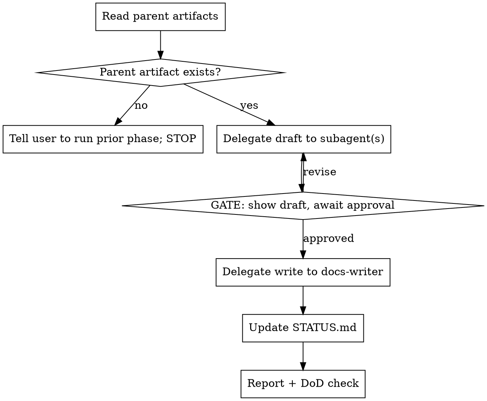

# minion v2.2.0 — Spec-Driven Project Management (Thinking Doc)

> **Status:** Thinking / exploration. Builds on v2.0 (subagent delegation),
> v2.1 (primary agents), and v2.2.0 Phase 1 (`/init` → `PRD.md` + `AGENTS.md`).
> **Goal:** design a spec-driven-development (SDD) project-management *workflow*
> for **end users** of minion — a phase pipeline **Init → Plan → Spec → Review →
> Nightly → Stable** — and, more importantly, work out **how best to instruct an
> LLM to manage a project across those phases**.
> **This is the *what/why*.** A later `plan.md` / `specs.md` turns the
> recommendation here into shipped prompts, agents, and templates.

---

## 1. Motivation

Phase 1 gave a new project its two anchor files: `PRD.md` (what we're building and
why) and `AGENTS.md` (how the agent should build it). That's the *start line*. But
between "here's the PRD" and "we shipped it" there is a whole lifecycle that today
the user has to hold in their head or scatter across chat history:

- What is *this feature* trying to achieve, and how does it ladder up to a business
  objective in the PRD?
- What is the concrete task list, and what tests prove it satisfies the objective?
- Did the code actually do what the spec said? Is it secure? Does the *result*
  still match the *plan*?
- What landed in nightly? What got promoted to stable?

The insight of **spec-driven development** is that these questions are answered by
**artifacts**, not by memory. Each phase produces a durable markdown document, and
each document is the input contract for the next phase. The chain forms a **golden
thread**:

```
Business objective (PRD)
   └─▶ Plan objective ──▶ Goal ──▶ Spec task ──▶ Test ──▶ Review check ──▶ Release note
```

If every artifact carries a stable ID and links to its parent, then at any point
you can ask "does this line of code trace back to a business objective?" and "is
every objective covered by a shipped, reviewed, released change?" — and the answer
is a file lookup, not a judgment call.

### Why this fits minion (and not v1)

v1 tried to *track* projects with code: a persistent kanban board, a
`~/.pi/projects/<id>/` workspace, deterministic project IDs, session resume. v2
**removed all of it** ([v2.0/design.md §3](../../v2.0/design.md)) because that
machinery was heavy, stateful, and coupled to the host session.

The SDD workflow gets us the *benefit* v1 was reaching for (a trackable project
lifecycle) **without the machinery**: the "board" is a markdown file the LLM reads
and writes; the "workspace" is the repo's own `docs/` tree; "resume" is just
`read`-ing the artifacts. This is exactly the Phase 1 bet — `/init` proved that a
zero-code workflow prompt + a delegated `docs-writer` subagent can produce and
maintain structured project docs. Phase 2 extends that bet from *one* bootstrap
prompt to a *pipeline* of them.

**In scope:** workflow prompts (`/plan-feature`, `/spec`, `/review`, `/nightly`,
`/stable`), a few new subagents, artifact templates, a single human-readable status
manifest.
**Out of scope (still):** any resurrected `task` board tool, project workspace,
project IDs, or session-start resume. See [§9](#9-explicitly-not-building).

---

## 2. Design principles — how to instruct an LLM to manage a project

This is the heart of the doc. Everything below in the phase design is an
application of these nine principles. They are distilled from what already works in
`/init` (the interview + gate + delegate pattern) and from the failure modes of
letting an LLM "manage a project" free-form.

### P1 — Artifacts are the state (files, not memory)

The LLM's context window is volatile and lossy. **Never** rely on the model
"remembering" the plan across turns or sessions. Every phase's output is written to
a file, and every phase's first action is to **read** the artifacts it depends on.
State lives on disk in git; the LLM is a stateless function over those files.

> **Why?** It makes the workflow resumable (any session can pick up by reading
> artifacts), auditable (git history is the changelog), and multi-agent-safe (a
> subagent with a fresh context can act because everything it needs is in the file
> it's handed). This is the same reason `/init` writes `PRD.md` instead of keeping
> the interview answers in context.

### P2 — One phase = one workflow prompt orchestrating isolated subagents

Each phase is a single `/command` (a prompt in `prompts/`). The prompt is the
*orchestrator*; the heavy lifting (deep reads, writes, reviews) is **delegated to
subagents** running in their own `pi --mode json` subprocess. The parent keeps a
clean context and a clear control flow; the subagent gets a fresh, focused window.

> **Why?** Mirrors v2's core mechanic ([v2.0 §](../../v2.0/design.md)). A Review
> phase that reads the whole diff *in the parent* would blow the context budget;
> a Review phase that hands the diff to a `reviewer` subagent stays lean and can
> even fan the three review lenses out in **parallel**.

### P3 — Explicit approval gates; HARD-GATE before any write

Borrow the `/init` gate pattern verbatim: the LLM interviews / drafts, then
**stops** and shows the user what it's about to write, and only writes after
explicit approval ("yes" / "go" / "ship it"). Silence = wait. Destructive or
outward actions (writing spec, opening the build, cutting a release note) are
gated.

> **Why?** PM artifacts steer real work. An LLM that silently writes a spec the
> user disagrees with wastes a whole build cycle. `/init`'s Gate 3 ("no writes
> until approved") is the model.

### P4 — Traceability IDs threaded across artifacts

Give every first-class item a short, stable ID and require each downstream item to
reference its parent:

| Artifact | ID prefix | Example | Links to |
|----------|-----------|---------|----------|
| PRD business objective | `OBJ-` | `OBJ-2` | — (root) |
| Plan goal | `G-` | `G-1` | one `OBJ-` |
| Spec task | `T-` | `T-3` | one or more `G-` |
| Test spec | `TEST-` | `TEST-3` | the `T-`/`G-` it proves |
| Review check | `CHK-` | `CHK-7` | the `T-`/`OBJ-` it verifies |
| Release entry | `REL-` | `REL-1` | the feature slug + `OBJ-`s shipped |

> **Why?** IDs are what make Review's "business review" and the release reports
> *mechanical* instead of vibes-based. "Does every result align with the plan?"
> becomes "does every `G-` have a passing `CHK-`?" The LLM is far more reliable
> checking a table of IDs than re-reasoning intent from prose.

### P5 — Idempotency; never overwrite silently

Every phase first checks whether its artifact already exists. If it does, the LLM
proposes an **update/append with a diff summary** and gates on it — it never
clobbers. New per-phase artifacts are append-friendly (e.g. a Review appends a
dated section rather than replacing the file).

> **Why?** Same guard as `/init` ("skip if `PRD.md` + `AGENTS.md` exist"). Losing a
> hand-edited plan to a regeneration is the worst possible failure.

### P6 — Lean, scannable, template-shaped outputs

Artifacts follow fixed templates with placeholders (like `templates/init/`), have
line budgets, and ban prose preamble and LLM-isms ("This document outlines…").
Short enough that the *next agent* actually reads them.

> **Why?** A 200-line plan gets skimmed; a 40-line plan gets read. The whole value
> of the golden thread evaporates if the artifacts are too long to load into the
> next phase's context. `/init` enforces `AGENTS.md ≤ 30`, `PRD.md ≤ 45` for
> exactly this reason.

### P7 — Delegate heavy read / write / review to subagents

The parent orchestrator should almost never call `write` or read a large diff
itself. It builds a **structured task string** (template + value map + output path
+ constraints) and hands it to a subagent, exactly as `/init` hands work to
`docs-writer`. Reviews go to review subagents; release notes go to a notes writer.

> **Why?** Keeps parent context clean (P2), gives the user an auditable structured
> result, and lets read-only *primaries* (e.g. `plan`) still run write-producing
> phases because the subagent owns the `write` tool.

### P8 — Anti-patterns block at the top of every phase prompt

Every prompt opens with 2–3 named anti-patterns ("This feature is too small to need
a spec", "I already know what to build, skip the plan", "I'll just review it in my
head") and pushes back on them. `/init` does this and it's the single most
effective guard against the LLM shortcutting the process.

> **Why?** LLMs rationalize skipping process ("this is simple, I'll just…"). Naming
> the rationalization up front and rebutting it is what keeps the discipline.

### P9 — Definition of Done per phase

Each phase ends with an explicit DoD checklist the LLM must satisfy before it
considers the phase complete (artifact written, IDs assigned, parent links present,
`STATUS.md` updated, user shown the result).

> **Why?** Gives the LLM a concrete stop condition and the user a concrete
> acceptance test. Prevents "half-done" phases that leave dangling IDs.

---

## 3. The phase pipeline

Six phases. Each subsection gives **purpose · inputs · outputs · subagent(s) ·
gates · DoD**. Phases are independently invocable — you don't have to run them in
one session; you run `/spec` when you're ready to spec, and it reads the plan
artifact from disk (P1).

```
Init ──▶ Plan ──▶ Spec ──▶ (build with /implement) ──▶ Review ──▶ Nightly ──▶ Stable
 PRD.md    plan.md   spec.md          code               review.md   nightly-*   stable-*
 AGENTS.md
```

### 3.1 Init — *(shipped in Phase 1)*

| | |
|---|---|
| **Purpose** | Bootstrap: capture business objectives (`PRD.md`) + conventions (`AGENTS.md`). |
| **Inputs** | Interactive 8-question interview. |
| **Outputs** | `PRD.md` (with `OBJ-n` business objectives), `AGENTS.md`. |
| **Subagent** | `docs-writer`. |
| **Command** | `/init` (already exists). |

Phase 2 change: the PRD template should tag each business objective with an `OBJ-n`
ID so downstream plans can link to it (P4). This is a small template edit to
`templates/init/PRD.template.md`, not a redesign.

### 3.2 Plan — business plan of a feature → `plan.md`

| | |
|---|---|
| **Purpose** | Turn a feature idea into a *business* plan: what it achieves and why, before any technical detail. |
| **Inputs** | `PRD.md` (for `OBJ-n` to link to), user's feature description. |
| **Outputs** | `docs/features/<slug>/plan.md` with **Objectives**, **Goals**, **Non-Goals**, **Scope**. |
| **Subagent(s)** | `planner` (drafts), `docs-writer` (writes). |
| **Gates** | Gate A: objectives/goals confirmed. Gate B (HARD): planned `plan.md` approved before write. |
| **Command** | `/plan-feature` *(name collision with `plan` primary — see [O1](#10-open-questions))* |

**Artifact shape (`plan.md`):**

```markdown
# Plan — {{feature_name}}  ({{slug}})
> Links: PRD {{objective_ids}}   ·   Status: draft

## Objectives
Business outcomes this feature drives. Each links to a PRD objective.
- **{{obj_local}}** → PRD `OBJ-{{n}}` — {{one-line why}}

## Goals
Measurable, checkable results for THIS feature.
- `G-1` — {{goal}} (metric: {{metric}})

## Non-Goals
Explicitly not doing (this feature / this milestone).
- {{non_goal}}

## Scope
- **In:** {{in_scope}}
- **Out:** {{out_scope}}
- **Touches:** {{systems/modules}}
```

**DoD:** every `Goal` has a metric and links ≥1 PRD `OBJ-`; Non-Goals non-empty;
`STATUS.md` row added with state `planned`.

### 3.3 Spec — technical spec + build prompt → `spec.md`

| | |
|---|---|
| **Purpose** | Turn the business plan into an executable **build prompt**: the todo list, the tests that prove the plan, and the coding instructions. |
| **Inputs** | `plan.md` (goals `G-n`), `AGENTS.md` (conventions), `scout` recon of the codebase. |
| **Outputs** | `docs/features/<slug>/spec.md` with **Todo list**, **Testing specs**, **Coding instructions**. |
| **Subagent(s)** | `scout` (recon), `planner` (task breakdown), `docs-writer` (writes). |
| **Gates** | Gate (HARD): spec approved before write; it becomes the contract `/implement` executes. |
| **Command** | `/spec` |

**Artifact shape (`spec.md`) — this *is* the build prompt:**

```markdown
# Spec — {{feature_name}}  ({{slug}})
> Links: Plan goals {{goal_ids}}   ·   Status: specced

## Todo List
Ordered, each task links to the goal(s) it advances.
- [ ] `T-1` — {{task}}  → `G-1`   · files: {{paths}}
- [ ] `T-2` — {{task}}  → `G-1`,`G-2`

## Testing Specs  (aligned to business objectives)
Each test proves a goal/objective is met, not just that code runs.
- `TEST-1` proves `G-1` — {{given/when/then}}   · type: unit|integration|e2e
- `TEST-2` proves `OBJ-2` end-to-end — {{scenario}}

## Coding Instructions
- **Conventions:** follow `AGENTS.md` ({{stack/rules}}).
- **Approach:** {{high-level how}}
- **Constraints:** {{perf/security/compat limits}}
- **Done when:** all `T-` checked AND all `TEST-` pass.
```

**DoD:** every `T-` links a `G-`; every `G-` has ≥1 `TEST-`; coding instructions
reference `AGENTS.md`; `STATUS.md` state → `specced`. The user can then run the
existing `/implement` (scout → planner → worker) *feeding it `spec.md`*.

> **Why the spec is the build prompt:** rather than invent a new build phase, Spec
> produces a document precisely shaped to be pasted into / read by the existing
> `/implement` chain. Spec-driven means the spec *drives* the build.

### 3.4 Review — code + security + business → `review.md`

| | |
|---|---|
| **Purpose** | Verify the built code against three lenses: it does what the **spec** says, it's **secure**, and the **result aligns with the plan**. |
| **Inputs** | `spec.md` (tasks/tests), `plan.md` (objectives/goals), the diff/code. |
| **Outputs** | `docs/features/<slug>/review.md` — one artifact, three sections. |
| **Subagent(s)** | `reviewer` (code), `security-reviewer` (security), `business-reviewer` (business) — **run in parallel** (P2). |
| **Gates** | Gate: user decides go / fix / block based on verdict. |
| **Command** | `/review` |

**Three lenses (each a `CHK-`):**

| Lens | Question | Subagent | Passes when |
|------|----------|----------|-------------|
| **Code review** | Does the code do what `spec.md` says? | `reviewer` | every `T-` implemented, every `TEST-` present & green |
| **Security review** | Is the code free of vulnerabilities? | `security-reviewer` | no critical/high findings; inputs validated, secrets safe |
| **Business review** | Does every result align with `plan.md`? | `business-reviewer` | every `G-` met by a `CHK-`; no scope creep past Non-Goals |

**Artifact shape (`review.md`):**

```markdown
# Review — {{feature_name}}  ({{slug}})  ·  {{date}}
> Verdict: pass | fix-required | block

## Code Review  (vs spec)
- `CHK-1` `T-1` ✅ implemented / ❌ `file:line` — {{issue}}
## Security Review
- `CHK-4` ✅ / 🔴 `file:line` — {{vuln class}} — {{fix}}
## Business Review  (vs plan)
- `CHK-6` `G-1` ✅ met / ⚠️ partial — {{gap}}
- Scope check: no work outside `plan.md` Non-Goals ✅ / ⚠️
## Verdict & Required Fixes
1. {{must-fix}} → back to `/implement`
```

**DoD:** all three sections present; every `G-` and `T-` has a `CHK-`; verdict set;
`STATUS.md` state → `reviewed` (or `fix-required`).

> **One prompt, three subagents** (recommended) keeps the golden thread in a single
> file and lets the three lenses fan out concurrently. Splitting into `/review-code`
> / `/review-security` / `/review-business` is the alternative ([O4](#10-open-questions)).

### 3.5 Nightly — release report of what shipped to nightly → `nightly-<date>.md`

| | |
|---|---|
| **Purpose** | Summarize which features (with passing reviews) landed in the nightly channel. |
| **Inputs** | Feature artifacts with `STATUS: reviewed`, **git history** (merge commits, tags since last nightly). |
| **Outputs** | `docs/releases/nightly-<date>.md`. |
| **Subagent(s)** | `scout` (git log recon) → `release-notes-writer`. |
| **Gates** | Gate: user confirms the feature set before the report is finalized. |
| **Command** | `/nightly` |

Sourcing is **artifacts + git only** (locked decision): the LLM reads
`git log`/`git tag` since the last nightly and cross-references feature `review.md`
verdicts. No CI hooks, no version-bump automation.

**Artifact shape:** date, channel, list of `REL-n` entries each naming the feature
slug, the `OBJ-`s it advances, the review verdict, and the merge commits.

**DoD:** every included feature has `STATUS: reviewed`; each `REL-` links its
feature + objectives; `STATUS.md` states → `nightly`.

### 3.6 Stable — release report of what was promoted to stable → `stable-<version>.md`

| | |
|---|---|
| **Purpose** | Report what graduated from nightly to a stable/tagged release. |
| **Inputs** | Prior `nightly-*.md` reports, git tags, features at `STATUS: nightly`. |
| **Outputs** | `docs/releases/stable-<version>.md`. |
| **Subagent(s)** | `scout` → `release-notes-writer`. |
| **Gates** | Gate: user confirms version + included features. |
| **Command** | `/stable` |

Stable **promotes** nightly entries: it reads the nightly reports covering the
release window, filters to features that survived nightly, and produces a
version-stamped, user-facing summary. `STATUS.md` states → `stable`.

**DoD:** version set; every entry traces to a nightly `REL-`; no feature in stable
lacks a passing `review.md`.

---

## 4. Traceability model (the golden thread, worked)

The ID scheme from [P4](#p4--traceability-ids-threaded-across-artifacts), followed
end to end for one feature. This is what lets Review's business lens and the release
reports be a *lookup* rather than a *judgment*.

| Layer | ID | Content | Parent |
|-------|-----|---------|--------|
| PRD | `OBJ-2` | "Cut checkout drop-off" | — |
| Plan goal | `G-1` | "One-tap re-order for returning users" | `OBJ-2` |
| Spec task | `T-3` | "Add `/reorder` endpoint + button" | `G-1` |
| Test | `TEST-3` | "Returning user re-orders in ≤2 taps" | `G-1`,`T-3` |
| Review check | `CHK-7` | "Business: `G-1` met, ≤2 taps verified" | `G-1` |
| Release | `REL-1` | "One-tap re-order → nightly 2026-07-05" | slug, `OBJ-2` |

**Consistency checks any phase can run mechanically:**

- *Spec completeness:* every `G-` in `plan.md` has ≥1 `T-` and ≥1 `TEST-` in `spec.md`.
- *Review completeness:* every `T-`/`G-` has a `CHK-` in `review.md`.
- *Scope discipline:* no `T-` implements something in `plan.md`'s Non-Goals.
- *Release integrity:* no `REL-` includes a feature whose `review.md` verdict ≠ pass.

> **Why IDs beat prose:** an LLM asked "is this aligned with the plan?" will
> confabulate a yes. An LLM asked "list every `G-` with no matching `CHK-`" will
> produce a checkable table. The discipline is in the *shape of the question*.

---

## 5. Artifact layout (recommended default + alternatives)

**Recommended default** — per-feature directories under `docs/`, mirroring the
convention this repo already uses (`docs/v2.x/…`):

```
PRD.md                              # OBJ-n business objectives  (root, from /init)
AGENTS.md                           # conventions               (root, from /init)
docs/
├── STATUS.md                       # the "board": one row per feature (see §6)
├── features/
│   └── <slug>/
│       ├── plan.md                 # /plan-feature
│       ├── spec.md                 # /spec   (the build prompt)
│       └── review.md               # /review (append-per-run dated sections)
└── releases/
    ├── nightly-2026-07-05.md       # /nightly
    └── stable-1.2.0.md             # /stable
```

**Why this default:** everything about one feature lives in one directory (easy to
read, easy to `git mv`/archive); it reuses the `docs/` convention already in the
repo; release reports sit beside feature docs so cross-linking is short relative
paths.

| Alternative | Pros | Cons |
|-------------|------|------|
| **`specs/<slug>/…`** top-level tree | Clear "agent-managed" boundary, separate from human design docs | New top-level dir; two doc homes to reason about |
| **`.pi/pm/…`** hidden | Keeps PM churn out of the visible tree; signals "tooling" | Hidden from humans; feels like resurrecting v1's workspace ([§9](#9-explicitly-not-building)) |

Layout is a template/prompt constant, so switching later is a one-line change per
prompt.

---

## 6. Tracking model — zero-code vs a little code

**Recommendation: zero-code.** The "board" is `docs/STATUS.md`, a plain markdown
table that a subagent updates at the end of each phase (P1, P7). It is
human-readable, git-diffable, and needs **no** new tool, no state file the extension
owns, no schema.

```markdown
# STATUS
| Feature | Slug | State | PRD | Plan | Spec | Review | Release |
|---------|------|-------|-----|------|------|--------|---------|
| One-tap re-order | reorder | reviewed | OBJ-2 | ✅ | ✅ | pass | — |
| Guest checkout | guest | specced | OBJ-1 | ✅ | ✅ | — | — |
```

State machine (just a string in the row): `planned → specced → built → reviewed →
nightly → stable` (or `fix-required`). Each phase's DoD includes "update the
`STATUS.md` row."

### Where a *little* code would actually help (user decides)

Zero-code has one real weakness: the LLM is the only thing enforcing that
`STATUS.md` stays consistent with the artifacts, and LLMs occasionally forget to
update a row or mis-transition a state. A small, optional amount of code could
harden exactly that seam — **without** bringing back v1's kanban:

| Pain point (zero-code) | Minimal code that fixes it | Cost / risk |
|------------------------|----------------------------|-------------|
| `STATUS.md` drifts from artifacts | A read-only `pm_status` tool/command that *derives* the table by scanning `docs/features/*/` frontmatter — never authoritative state, just a view | ~1 small module; read-only; no persisted state |
| Broken traceability (a `G-` with no `TEST-`) slips through | A `pm_check` command that validates the ID graph across artifacts and prints violations | ~1 module; pure function over files |
| Manual state transitions error-prone | Have the derive/check tool compute state from artifact presence instead of a hand-edited cell | folds into the above |

Note the tension: even a read-only derive/check tool edges toward the
"project tracking" subsystem v2 removed ([v2.0 §3](../../v2.0/design.md)). The
crucial difference from v1 — and the line I'd hold — is **no persisted state and no
project workspace**: any code here is a *pure function over the markdown artifacts*
(a lens), never a source of truth. If we keep that invariant, it's compatible with
v2's philosophy; if we relax it, we're rebuilding the board.

**My recommendation:** ship Phase 2 **zero-code** first (all six prompts + agents +
templates + `STATUS.md`), *then* — only if drift proves painful in real use — add
the read-only `pm_check`/`pm_status` lens as a Phase 2.1. Prove the workflow before
adding any code to it.

---

## 7. New building blocks (concrete drafts)

### 7.1 Subagents

Reuse existing: `scout` (recon), `planner` (drafting plans/tasks), `reviewer`
(code lens), `docs-writer` (all writes). **New** definitions needed (same
frontmatter style as `agents/reviewer.md`):

```markdown
---
name: security-reviewer
type: subagent
description: Security review specialist — audits a diff for vulnerabilities against a spec
tools: read, grep, find, ls, bash
model: claude-sonnet-4-5
---
You are a security reviewer. Given a spec and a diff, find vulnerabilities:
injection, authz/authn gaps, secret exposure, unsafe deserialization, SSRF,
path traversal, missing input validation. Bash is READ-ONLY (`git diff/log/show`).
Output: `CHK-n` findings by severity (🔴 critical / 🟠 high / 🟡 medium), each with
`file:line`, the vulnerability class, and a concrete fix. No code changes.
```

```markdown
---
name: business-reviewer
type: subagent
description: Verifies implemented results align with the feature plan (goals, scope, non-goals)
tools: read, grep, find, ls, bash
model: claude-sonnet-4-5
---
You are a business reviewer. You receive plan.md (Objectives/Goals/Non-Goals/Scope)
and the implementation. For EACH goal `G-n`, decide met / partial / missing and cite
evidence (`file:line`, test name). Flag any work outside Scope or violating a
Non-Goal (scope creep). Output `CHK-n` rows linking each to its `G-`. You do NOT
judge code quality or security — only alignment to the plan.
```

```markdown
---
name: release-notes-writer
type: subagent
description: Generates nightly/stable release reports from feature artifacts + git history
tools: read, grep, find, ls, bash
model: claude-sonnet-4-5
---
You are a release-notes writer. Inputs: a set of feature dirs (plan/spec/review) and
git range. Bash is READ-ONLY (`git log`, `git tag`, `git show`). Produce dated
`REL-n` entries: feature name, objectives advanced (`OBJ-`), review verdict, merge
commits. Only include features with a passing review. Terse, user-facing, no LLM-isms.
```

### 7.2 Workflow prompts

Five new prompts in `prompts/`, each following the `/init` shape (frontmatter
`description` → anti-patterns → checklist → gates → delegation → DoD → `dot` flow):

| Command | Reads | Writes (via subagent) | Orchestrates |
|---------|-------|-----------------------|--------------|
| `/plan-feature` | `PRD.md` | `docs/features/<slug>/plan.md` | `planner` → `docs-writer` |
| `/spec` | `plan.md`, `AGENTS.md` | `docs/features/<slug>/spec.md` | `scout` → `planner` → `docs-writer` |
| `/review` | `spec.md`, `plan.md`, diff | `docs/features/<slug>/review.md` | `reviewer` ∥ `security-reviewer` ∥ `business-reviewer` → `docs-writer` |
| `/nightly` | reviewed features, git | `docs/releases/nightly-<date>.md` | `scout` → `release-notes-writer` |
| `/stable` | nightly reports, git tags | `docs/releases/stable-<version>.md` | `scout` → `release-notes-writer` |

### 7.3 Templates

Under `templates/` (placeholder style like `templates/init/`):
`plan.template.md`, `spec.template.md`, `review.template.md`,
`nightly.template.md`, `stable.template.md`, `STATUS.template.md`. Each ends with a
"Template Reference" section mapping `{{placeholder}}` → required/optional, so
`docs-writer` can substitute mechanically (its existing contract).

---

## 8. How each phase instructs the LLM (prompt skeletons)

Condensed drafts showing the shape. Full versions become `prompts/*.md`.

**`/spec` skeleton:**

```markdown
---
description: Turn an approved feature plan into an executable build prompt (spec.md) — todo list, testing specs aligned to objectives, coding instructions.
---
# /spec — Feature Technical Spec

## Anti-Patterns
- "I already know what to build, skip the plan" — read plan.md; the goals ARE the contract.
- "Tests can come later" — a spec without TEST-n has no way to prove the objective.

## Checklist
1. Locate the feature: ask for slug; read docs/features/<slug>/plan.md and AGENTS.md.
   If plan.md is missing, tell the user to run /plan-feature first and STOP.
2. Delegate recon: subagent({ agent: "scout", task: "recon <areas from plan Scope>" }).
3. Delegate task breakdown: subagent({ agent: "planner", task: <plan goals + scout output
   + "produce T-n tasks each linked to a G-, and TEST-n proving each G-"> }).
4. GATE (HARD): show the drafted Todo + Testing specs + Coding instructions. Wait for approval.
5. Delegate write: subagent({ agent: "docs-writer", task: <spec.template + value map +
   output path docs/features/<slug>/spec.md + line budget> }).
6. Update STATUS.md row → specced (delegate to docs-writer).
7. DoD: every G- has ≥1 T- and ≥1 TEST-; coding instructions cite AGENTS.md.
```

**`/review` skeleton (parallel lenses):**

```markdown
## Checklist
1. Read spec.md + plan.md for <slug>. Get the diff range (default: since branch point).
2. Fan out THREE subagents in parallel (subagent parallel mode):
   - reviewer         → "verify each T- implemented, each TEST- present; CHK- findings"
   - security-reviewer→ "audit diff for vulns; CHK- findings by severity"
   - business-reviewer→ "verify each G- met vs plan; flag scope creep; CHK- findings"
3. Merge the three result sets; compute verdict (block if any 🔴 or missing G-).
4. GATE: present verdict + required fixes.
5. Delegate write of review.md (append dated section) + STATUS.md update.
6. DoD: every G-/T- has a CHK-; verdict set.
```

`/plan-feature`, `/nightly`, `/stable` follow the same skeleton (anti-patterns →
checklist → gate → delegate write → DoD).

**Process flow (all phases share this shape):**



---

## 9. Explicitly NOT building

Holding the v2 line ([v2.0/design.md §3](../../v2.0/design.md)):

- **No `task` board tool / kanban** — `STATUS.md` is a markdown file, not a tool
  with persisted state.
- **No `~/.pi/projects/<id>/` workspace, no project IDs, no marker files** —
  artifacts live in the repo's own `docs/`, versioned by git.
- **No session-start resume / `before_agent_start` injection** — resume = the next
  session runs `/spec` (etc.) and reads artifacts from disk.
- **No CI integration / version-bump automation** — Nightly/Stable read git +
  artifacts and *report*; they don't cut tags or edit `package.json`.
- **Graceful degradation** — every phase that can't find its parent artifact tells
  the user which phase to run first and stops; nothing crashes the host session.

---

## 10. Open questions

- **O1 — `/plan` name collision.** v2.1 registers a `plan` *primary* (Shift+Tab
  persona). A `/plan` prompt would be confusing. Proposal: name the feature-plan
  prompt **`/plan-feature`** (or `/feature-plan`). Decide the command name.
- **O2 — Granularity: per-feature vs per-milestone.** The design assumes one
  `plan.md`/`spec.md` per *feature*. Large milestones may want a milestone plan
  that spawns several feature specs. Keep per-feature for v1 of Phase 2?
- **O3 — Is `STATUS.md` auto-loaded?** Like `PRD.md`, probably **not** auto-injected
  (context cost); phases `read` it on demand. Confirm.
- **O4 — Review: one prompt/three subagents vs three prompts.** Recommend one
  `/review` fanning out three subagents (single golden-thread artifact, parallel
  execution). Alternative: `/review-code|-security|-business` for à-la-carte runs.
- **O5 — Zero-code vs read-only lens.** Ship zero-code first; add `pm_check`
  (read-only ID-graph validator) only if drift proves painful ([§6](#6-tracking-model--zero-code-vs-a-little-code)).
- **O6 — `slug` derivation.** Ask the user, or derive from feature name? Lean:
  ask once in `/plan-feature`, reuse everywhere via the directory path.

---

## 11. Definition of Done (for this thinking doc) & suggested work packages

This doc is done when it (✅ below) gives a buildable picture. Turning it into
shipped Phase 2:

- **WP0 — Decide open questions** O1–O6 (esp. command naming, granularity).
- **WP1 — Templates** — `plan/spec/review/nightly/stable/STATUS` templates under
  `templates/`, each with a Template Reference section.
- **WP2 — Subagents** — add `security-reviewer`, `business-reviewer`,
  `release-notes-writer` to `agents/`; add `OBJ-n` IDs to the PRD template.
- **WP3 — Prompts** — `prompts/plan-feature.md`, `spec.md`, `review.md`,
  `nightly.md`, `stable.md`, full `/init`-style (anti-patterns, gates, delegation,
  DoD, flow).
- **WP4 — Bundle validation** — extend `bundled.test.ts` to assert the new prompts
  parse and reference their templates + subagents.
- **WP5 — Docs** — README "Workflow Prompts" section + a short SDD walkthrough.
- **WP6 (optional) — read-only `pm_check`/`pm_status` lens** — only if [§6](#6-tracking-model--zero-code-vs-a-little-code) drift materializes.

**Coverage check (against the original request):**

| Requested | Covered in |
|-----------|-----------|
| Init → PRD.md + AGENTS.md | §3.1 (shipped; + `OBJ-n` tagging) |
| Plan → Objectives/Goals/Non-Goals/Scope | §3.2 |
| Spec → Todo / Testing specs / Coding instructions (build prompt) | §3.3 |
| Review → Code / Security / Business | §3.4 |
| Nightly report | §3.5 |
| Stable report | §3.6 |
| "Best way to instruct the LLM" | §2 (nine principles) + §8 (skeletons) |
```
