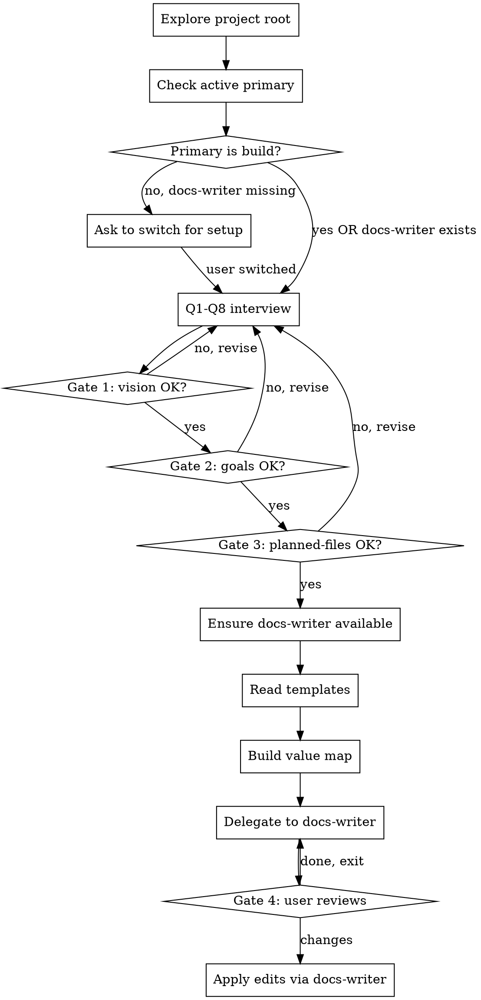

# `/init` — Project Bootstrap

Help a user turn a blank (or under-documented) project directory into a working
pair of scaffolding files: **`AGENTS.md`** (coding agent conventions) and
**`PRD.md`** (product requirements). Interview them one question at a time,
get explicit approval at each gate, and only then write the files.

<HARD-GATE>
Do NOT write `AGENTS.md` or `PRD.md` until Gate 3 (planned-files) is approved by
the user. No shortcuts, no "I'll just fill in the blanks", no auto-approve. This
applies to every project regardless of perceived simplicity.
</HARD-GATE>

## Anti-Pattern: "This Project Is Too Small To Need AGENTS.md / PRD.md"

Every project gets both files. A 50-line CLI tool still needs `AGENTS.md` (even
if it's 8 lines) so the next agent in the project inherits the conventions, and
a weekend hack still benefits from a 6-line `PRD.md` to anchor scope. If the
user pushes back, gently insist — the goal is to make future work cheaper, not
to ship scaffolding that takes longer to write than the project itself.

The interview can be short (a few minutes) for small projects. Templates are
**lean by design** — 30 lines max for AGENTS, 45 lines max for PRD.

## Anti-Pattern: "I Already Know The Stack, Just Write It"

You do not know the stack. Ask. Even if the user has stated pieces of it
upthread, the interview is the source of truth — assumptions are the #1 cause
of agents generating wrong scaffolding.

## Anti-Pattern: "I'll Fill In The Brackets Later"

`{{placeholders}}` filled from the interview should cover **all required
fields**. Brackets like `[bracketed text]` are only for genuinely unknown
fields the user skipped. If a field is `[bracketed]`, the user MUST see a clear
list of what they still need to fill in after the files are written.

## Checklist

You MUST complete these in order, and you SHOULD announce them as a todo list
so the user can see progress:

1. **Explore project context** — `ls` the project root. If both `AGENTS.md`
   and `PRD.md` already exist, notify the user and **STOP** (this is a
   one-time bootstrap). If only one exists, ask whether to regenerate the
   other or both.
2. **Check active primary** — see "Primary Mode Check" below. If the user is
   not in `build` primary, you can still proceed: the `docs-writer` subagent
   handles all file writing in an isolated subprocess.
3. **Conduct interactive interview** — 8 questions, one at a time. See
   "The Interview" below.
4. **Present generated plan** (Gate 3) — show the user the planned contents of
   both files (skeleton, not final). Get approval.
5. **Ensure docs-writer agent is available** — call
   `subagent({ list: true })` to discover installed agents. If `docs-writer`
   is in the roster, proceed to step 6. If not, create it as a project-local
   subagent at `.pi/agents/docs-writer.md` (copy the bundled definition from
   the minion package). See "docs-writer Agent Definition" below.
6. **Read templates** — read `templates/init/AGENT.template.md` and
   `templates/init/PRD.template.md` from the minion package.
7. **Build value map + delegate to docs-writer** — assemble the
   `placeholder -> value` mapping from interview answers, then call
   `subagent({ agent: "docs-writer", task: <task> })` with templates, values,
   and output paths. The subagent writes both files and returns the result.
8. **User reviews written files** (Gate 4) — point the user to the files, ask
   for any edits. Offer to delegate a follow-up to `docs-writer` for targeted
   fixes.

## Primary Mode Check

Writing `AGENTS.md` and `PRD.md` is delegated to the `docs-writer` subagent,
which runs in its own `pi --mode json` subprocess with its own tool set
(including `write`). That means **you do not need to be in `build` primary**
to run `/init` — the subagent handles the actual file writes.

The one exception is creating the `docs-writer` agent file itself, which you
do in the parent session. Detection:

- If `docs-writer` is already in the agent roster (`subagent({ list: true })`),
  proceed without any primary check.
- If `docs-writer` is missing and you are in `build` primary, create
  `.pi/agents/docs-writer.md` directly (see "docs-writer Agent Definition"
  below) and continue.
- If `docs-writer` is missing and you are in a read-only primary (e.g. `plan`),
  say:

  > "The `docs-writer` subagent isn't installed yet. I need to create
  > `.pi/agents/docs-writer.md` to register it (one-time setup). Can you
  > switch to `build` with `/build` and re-invoke `/init`? After this one
  > setup, the subagent handles all file writing and the primary no longer
  > matters."

  Then **stop and wait**. Do not run the interview in a read-only primary if
  the agent file also needs to be created — you will waste the user's time.

## The Interview

Ask **one question per turn**. Wait for the answer before asking the next.
Prefer **multiple choice** when options are enumerable; use open-ended prompts
otherwise. Keep the user's energy high — short questions, no preamble.

### Q1 — Project name + type

> "What are you building? Pick the closest type:
>
> A. Web app (browser-facing)
> B. CLI / terminal tool
> C. Library / package (consumed by other code)
> D. API service (no UI, serves clients over network)
> E. Mobile app
> F. Other / not sure
>
> And the project's name (one or two words)."

**Why MCQ here:** project type shapes the template defaults (a library doesn't
need `deploy`; a CLI doesn't need a data store; a web app does).

### Q2 — Tech stack

> "Now the stack. I'll ask one slice at a time so it's not overwhelming.
> **Runtime + language first:** pick one, or name your own:
>
> A. Node 20 + TypeScript
> B. Node 20 + JavaScript
> C. Bun + TypeScript
> D. Deno + TypeScript
> E. Python 3.12
> F. Go 1.22
> G. Other"

After runtime/language, follow up with the rest of the stack in **2 more
sub-questions** (frame, testing, lint) using MCQ when possible. Cover:
**framework**, **test runner**, **linter/formatter**, **package manager**,
**directory layout convention** (e.g. `src/` + `tests/` vs flat), and
**commit convention** (Conventional Commits / gitmoji / custom / none).

**Fallback:** if the user says "I don't care" or "you pick", propose the
common default for the chosen runtime and confirm.

### Q3 — Vision

> "In one sentence, what problem does this project solve and for whom?
> (Example: 'A CLI for converting markdown to PDF, for technical writers
> who need offline-friendly exports.')"

This is the **only** open-ended Q in the first half — keep it short.

### Q4 — Target users

> "Who is this for? Pick all that apply:
>
> A. Developers (you or other engineers will use the API / CLI)
> B. End users (non-technical, browser/mobile)
> C. Internal team (your company, ops / support)
> D. Both developers and end users
> E. Other"

For each chosen role, follow up: "What's the single most important thing this
role needs from the project?"

### Q5 — First milestone goals

> "For milestone 1 (the first thing you'll ship), what are 2-3 measurable
> outcomes? (Example: 'User can sign up and log in', 'CLI converts 10-file
> batch in under 2 seconds', 'Public API returns 99th-percentile latency
> under 100ms'.)"

Push back on vague goals: "support many users" is not measurable; "supports
1k concurrent connections" is. If the user gives a vague goal, ask: "How
would you measure that?"

### Q6 — Architecture direction

> "Pick the deployment shape:
>
> A. Monolith (single deployable unit)
> B. Modular monolith (one deployable, internal module boundaries)
> C. Microservices / multi-service
> D. Serverless (managed functions, no long-running servers)
> E. Static + edge (e.g. CDN-deployed frontend, no backend)
> F. Library-only (no deploy — published to npm/pypi/etc)
> G. Not sure / decide later"

Follow up: **data store** (Postgres / SQLite / DynamoDB / S3 / files / none),
**deploy target** (Vercel / Fly / AWS / Docker-on-VPS / local-only / npm
publish / other), and **key libraries** (open-ended: name 1-3 that are
non-obvious or load-bearing).

### Q7 — Out of scope (M1)

> "What is explicitly NOT in milestone 1? (Things you want users to know
> are deferred.) Examples:
>
> - Multi-tenancy
> - Real-time sync
> - Mobile app
> - Internationalization
> - Admin panel
>
> Give me a list — even 2-3 items is fine. This becomes the 'non-goals'
> section in PRD.md and the 'constraints' section in AGENTS.md."

If the user says "nothing", accept it but suggest 1-2 common non-goals for
their project type to make the PRD more useful.

### Q8 — Roadmap

> "What comes after M1? Sketch 1-3 future phases. For each, give me a
> one-line focus and a rough timeline (e.g. 'M2: real-time sync — Q3').
> If you have no idea, say 'unspecified' and I'll mark them TBD."

This feeds the roadmap table in PRD.md.

## Approval Gates

Four gates, hard stops. Wait for explicit approval at each one.

### Gate 1 — After Q1-Q3 (vision checkpoint)

> "Here's what I have so far:
>
> - **Project:** `[name]`, type: `[type]`
> - **Stack:** `[runtime] + [framework] + [test runner] + [linter] + [PM]`
> - **Vision:** `[user's one-sentence answer]`
>
> Does this look right? Anything to correct before I dig into users + goals?"

### Gate 2 — After Q4-Q5 (goals checkpoint)

> "Here are your milestone-1 goals:
>
> 1. [goal 1] — [metric]
> 2. [goal 2] — [metric]
> 3. [goal 3] — [metric]
>
> And target users:
> - [role 1]: [need]
> - [role 2]: [need]
>
> Goals measurable, users right?"

### Gate 3 — After Q6-Q8 (planned-files checkpoint)

> "Here's the full plan. I'll write:
>
> **`AGENTS.md`** (≤ 30 lines) with these sections:
> - Stack: [runtime] + [framework] + [test] + [linter] + [PM]
> - Rules: read-before-edit, type everything, test business logic,
>   small PRs, ask if ambiguous
> - Directory layout: [layout]
> - Commit convention: [convention]
> - Constraints: [from Q7 non-goals]
>
> **`PRD.md`** (≤ 45 lines) with these sections:
> - Vision: [vision]
> - Users: [roles + needs]
> - Goals (M1): [2-3 measurable]
> - Non-goals (M1): [from Q7]
> - Architecture: [style] + [data] + [deploy] + [key libs]
> - Boundaries: in-scope / out-of-scope / ownership
> - Roadmap: [phases from Q8]
>
> Approve and I'll write both files. Or tell me what to change."

**This is the HARD-GATE.** No writes until the user explicitly says yes (or
equivalent — "looks good", "go", "ship it", "do it").

### Gate 4 — After writing (review checkpoint)

> "Done. The `docs-writer` subagent wrote:
> - `./AGENTS.md`
> - `./PRD.md`
>
> Open both and let me know if you want any edits. If any field is
> `[bracketed]`, those are the spots you'll need to fill in by hand.
> Targeted fixes can go through `docs-writer` again."

## Writing The Files

All file writing is delegated to the `docs-writer` subagent. The parent
session's job is to prepare inputs, the subagent's job is to substitute
and write. This separation matters: the subagent has no interview context,
no architectural opinions, and runs in an isolated context window with
length and section constraints baked in.

### Step A — Ensure docs-writer agent is available

Call `subagent({ list: true })` to see the current roster. Three outcomes:

1. **`docs-writer` is in the roster** — proceed to Step B. No action needed.
2. **`docs-writer` is missing, parent has write tools** — create
   `.pi/agents/docs-writer.md` with the definition from "docs-writer Agent
   Definition" below, then proceed to Step B.
3. **`docs-writer` is missing, parent is read-only** — the "Primary Mode
   Check" section already handles this. Do not proceed.

If you create the agent file, confirm to the user:

> "Set up `.pi/agents/docs-writer.md` so the subagent is available for
> the write step. From now on, the subagent handles all file writes —
> you don't need to be in build mode."

### Step B — Read the templates

Read both template files in full **before** building the value map:

- `templates/init/AGENT.template.md`
- `templates/init/PRD.template.md`

The templates contain a "Template Reference" section at the bottom mapping
each `{{placeholder}}` to the question it came from. Use that as the
substitution map source — every `{{placeholder}}` you find should have a
matching interview answer (or be marked optional).

### Step C — Build value map

For each `{{placeholder}}` you find in either template:

1. If the user gave an answer in the interview, map it: `{{placeholder}}` → answer.
2. If the placeholder is `optional` in the template's reference section AND
   the user did not address it, **omit the entry entirely** (do not add a
   bracket — `docs-writer` will remove the line for you).
3. If the placeholder is `required` AND the user did not address it, map
   it to `[brackets for user to fill]`.

Do not add extras. The value map is exactly what the template expects.

### Step D — Delegate to docs-writer

Build the subagent `task` string with this structure:

```
Write two documentation files for project "{{project_name}}".

## Output Paths
- AGENTS.md: <absolute path to project root>/AGENTS.md
- PRD.md: <absolute path to project root>/PRD.md

## Template: AGENT.template.md
<full file contents from Step B read>

## Template: PRD.template.md
<full file contents from Step B read>

## Value Map
- {{project_name}} = MyProject
- {{runtime}} = Node 20
- {{language}} = TypeScript
- ... (all placeholders from both templates, in flat list)

## Constraints
- AGENTS.md must be ≤ 30 lines
- PRD.md must be ≤ 45 lines
- Project root only — do not write outside it
- No prose preamble in either file
```

Then call:

```
subagent({
  agent: "docs-writer",
  task: <task string above>,
  cwd: <project root absolute path>
})
```

**Do not write `AGENTS.md` or `PRD.md` yourself.** Always delegate. This
keeps the parent session's context clean and gives the user a structured
write result they can audit.

If the subagent returns errors (missing required values, length violations),
surface them to the user, ask whether to revise answers or relax constraints,
and re-delegate after the answer changes. Do not silently fill in defaults.

### Step E — Summarize

After the subagent returns:

- Show the user the list of files written and their final line counts.
- List any `[bracketed]` fields that need manual filling.
- List any warnings (e.g. line counts near the limit).
- Point to the Gate 4 review prompt.
- Offer to delegate a follow-up `docs-writer` task for targeted fixes.

## docs-writer Agent Definition

When you need to create `.pi/agents/docs-writer.md`, write this exact file
(frontmatter + body). The bundled copy in the minion package
(`agents/docs-writer.md`) is the source of truth — this is duplicated here
so the parent session does not need to read the package file at runtime.

```markdown
---
name: docs-writer
type: subagent
description: Writes and updates project documentation files (AGENTS.md, PRD.md, README.md) from templates + a placeholder value map. Read-write scope on project root.
model: claude-sonnet-4-5
---

You are a documentation writer agent. You receive a structured request from a parent agent containing:

1. **Template files** — markdown with `{{placeholders}}` to fill
2. **Value map** — explicit `placeholder -> value` mapping
3. **Output paths** — absolute paths where each filled file should be written
4. **Constraints** — line limits, section rules, style notes

You do NOT interview the user. You do NOT redesign the templates. You do NOT make architectural decisions. You mechanically substitute, prune optional placeholders, and write.

### Workflow

1. **Read the templates.** Use `read` on the supplied template paths. Confirm the `{{placeholders}}` they reference.
2. **Validate the value map.** Every required placeholder in the templates must have a value. If a required placeholder is missing, return an error result — do NOT substitute a placeholder for it.
3. **Substitute.** For each `{{placeholder}}`:
   - If the value map has it → substitute the exact value.
   - If the placeholder is marked `optional` in the template's reference section and the value map omits it → remove the entire line/section it lives in.
   - If the placeholder is `required` and the value map omits it → return an error listing every missing required placeholder.
4. **Honor length constraints.** AGENTS.md ≤ 30 lines, PRD.md ≤ 45 lines. If a substituted file exceeds the limit, compress verbose values to ≤ 2 lines each. Never drop required sections to meet the limit — if a single required section is too long, return an error.
5. **Write atomically.** Use `write` for each output file. One file at a time, no partial writes.
6. **Report.** Return a structured result with: files written (paths), bracketed fields remaining (if any), any warnings.

### Rules

- **No prose preamble** in generated files. Templates are the structure — match them exactly.
- **No invention.** If a value is not in the value map and not optional, do not invent one. Error out.
- **No extra sections.** Do not add sections that are not in the template, even if they seem helpful.
- **Lean output wins.** Terse values stay terse. Long values get distilled to 1-2 lines.
- **Project-root scope only.** You may only write to paths the parent agent explicitly names. Never write outside the project root.
- **One task, one subagent invocation.** The parent agent is responsible for orchestration; you do not spawn further subagents.

### Output Format

When done, return:

```
## Written
- `<path>` — `<lines> lines, <bracketed fields remaining>`
- `<path>` — `<lines> lines, <bracketed fields remaining>`

## Bracketed Fields (user must fill)
- `path/to/file.md` — `{{placeholder}}` on line N
- ...

## Errors (if any)
- Missing required placeholder: `{{foo}}` (no value supplied)
- File would exceed length limit: `path/to/file.md` would be 60 lines, limit 30
```

If you cannot complete the task (missing required values, length violation, write failure), return errors and DO NOT write any partial files.
```

## Key Principles

- **One question at a time** — never bundle Q1+Q2+Q3. The user should be
  able to answer in one or two words.
- **MCQ preferred** — but open-ended is fine for vision, goals, and roadmap
  where the answer is hard to enumerate.
- **Three anti-patterns at the top** — read them. They prevent the most
  common /init failures (skipping the interview, writing without approval,
  leaving the user to fill in everything).
- **HARD-GATE before write** — Gate 3 is non-negotiable. "Looks good" or
  explicit "yes" is required. Silence = wait.
- **Lean templates win** — a 30-line AGENTS.md that the agent actually reads
  beats a 200-line one that gets skimmed.
- **Reusable artifacts** — the written AGENTS.md and PRD.md should be
  readable by humans AND by the next agent that opens this project. Avoid
  LLM-isms ("This document outlines…"), marketing tone, or repetition.

## Process Flow



The terminal state is **Gate 4 → exit** after the user reviews the written
files and either requests edits (delegated back to `docs-writer`) or accepts
them.
